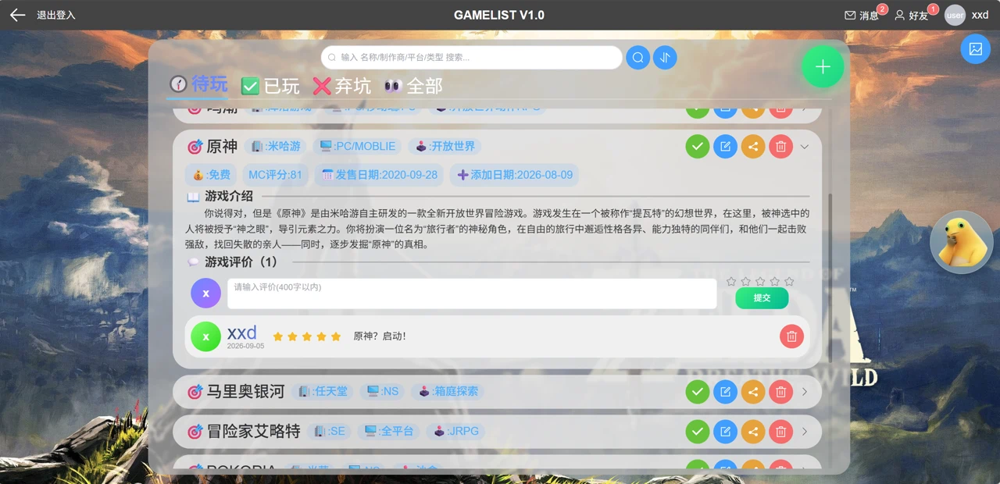
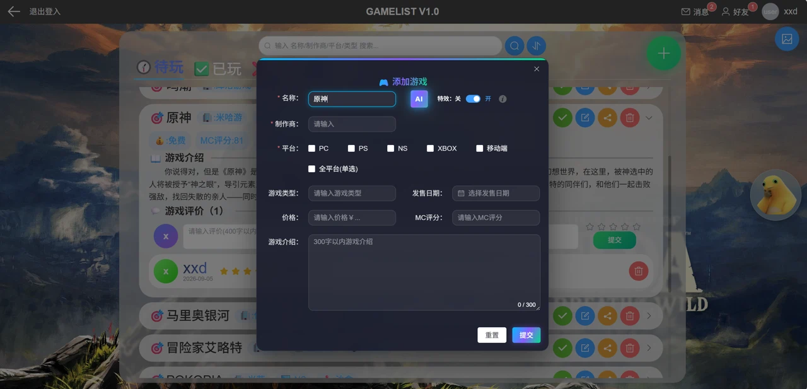
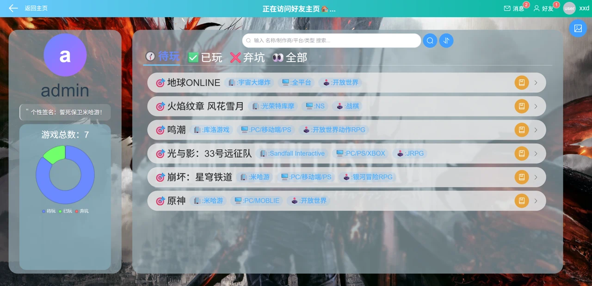
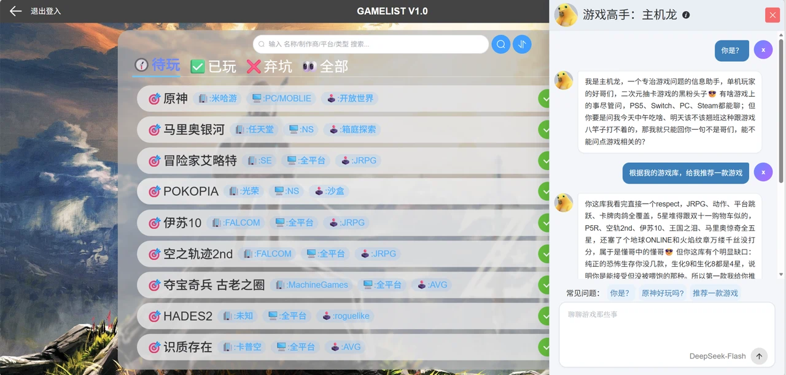

# GameList · 个人游戏收藏管理

一千万以内最好的个人游戏管理网站🥵：记录待玩/已玩/弃坑等游戏信息，打分，写评论，和好友分享游戏等等。除了基本功能外，还引入了 AI 功能，不可谓不遥遥领先🥰



## 功能

**游戏库管理**

- 添加游戏时支持只输入游戏名称，AI 补全开发商、平台、类型、简介、售价、Metacritic 均分、发售日期等其余信息
- 三种状态：待玩 / 已玩 / 弃坑，支持 1-5 星评分
- 按名称 / 厂商 / 平台 / 类型搜索，按评分或添加日期排序



**好友与互动**

- 搜索用户、发送好友申请、同意 / 拒绝
- 查看好友的游戏库和个人资料
- 把自己的游戏**分享**给好友，或向好友**申请**某款游戏
- 在游戏下留言评论
- 消息中心：分享、申请、好友变动、评论都会收到通知



**AI 游戏助手**

- 对话式问答，SSE 流式输出（逐字显示，不是等半天一次性出来）
- 能调用 `web_search` 联网查最新情报（新作发售日期、当前售价、评分等）
- 会读取你的游戏库和评分，据此推荐游戏
- 每人每日调用次数限制（Redis 计数，自然日过期）



## 技术栈

| 层 | 技术 |
|---|---|
| 后端 | Java 17 · Spring Boot 3.1.8 · MyBatis-Plus 3.5.7 · MySQL 8 · Redis · Druid · Flyway |
| 鉴权 | JWT（jjwt 0.12.6）+ 拦截器，密码 BCrypt 加盐存储 |
| AI | WebClient + OpenAI 兼容的 Responses API，SSE 流式转发给前端 |
| 前端 | Vue 3 · Vue CLI 5 · Element Plus · Pinia · Vue Router 4 · ECharts · Axios |
| 部署 | Nginx（HTTPS + 反向代理）· systemd |

## 项目结构

```
gamelist/
├── backend/                          Spring Boot 后端
│   └── src/main/
│       ├── java/org/example/gamelist/
│       │   ├── Controller/            接口层
│       │   ├── service/               业务逻辑
│       │   ├── mapper/                MyBatis-Plus 数据访问
│       │   ├── entity/ vo/ dto/       数据类型
│       │   ├── client/                AI 客户端（游戏信息查询 / 多轮对话）
│       │   ├── config/                WebClient / 拦截器 / AI 配置
│       │   ├── common/                JWT、统一响应、用户上下文
│       │   └── util/                  SSE 会话管理、对话历史存储
│       └── resources/
│           ├── application.yml         开发环境配置
│           ├── application-prod.yml    生产环境配置
│           └── db/migration/           Flyway 迁移脚本
├── frontend/                         Vue 前端
│   └── src/
│       ├── views/                     页面（登录 / 注册 / 主页 / 好友）
│       ├── components/                业务组件
│       ├── api/                       接口封装
│       └── store/                     Pinia 状态
└── docs/images/                      README 配图
```

## 快速开始

### 环境要求

- JDK 17+
- Maven 3.8+
- MySQL 8.0+
- Redis 6+
- Node.js 18+ 和 npm

### 1. 建数据库

```bash
mysql -u root -p -e "CREATE DATABASE gamelist DEFAULT CHARACTER SET utf8mb4 COLLATE utf8mb4_0900_ai_ci;"
```

> 数据库名称需要与 `application.yml` 中 JDBC 连接串里的名称一致。
> 表结构不用手工建，首次启动时 Flyway 会自动执行 `db/migration/V1__init.sql`。

### 2. 配置环境变量

应用启动时从环境变量读取敏感配置，**缺任何一个都会启动失败**：

```powershell
# Windows PowerShell
$env:DB_PASSWORD  = "你的 MySQL 密码"
$env:JWT_SECRET   = "至少 32 字节的随机字符串"
$env:QWEN_API_KEY = "AI 平台密钥"
```

> PowerShell 里可以用 `setx` 设置持久化环境变量，但**设置完需要新开一个终端窗口才生效**。

```bash
# Linux / macOS
export DB_PASSWORD="..."
export JWT_SECRET="..."
export QWEN_API_KEY="..."
```

> AI 服务默认接入的是千问 AI 聚合平台，若想切换其他服务商，修改 `application.yml` 中的 AI 配置即可。

### 3. 启动后端

```bash
cd backend
./mvnw spring-boot:run
```

后端跑在 `http://localhost:8081`。

### 4. 启动前端

```bash
cd frontend
npm install
npm run serve
```

访问 `http://localhost:8080`。

## 环境变量说明

| 变量 | 必填 | 说明 |
|---|---|---|
| `DB_PASSWORD` | ✅ | MySQL 连接密码 |
| `JWT_SECRET` | ✅ | JWT 签名密钥，**至少 32 字节**，可用 `openssl rand -hex 48` 生成 |
| `QWEN_API_KEY` | ✅ | AI 接口密钥，游戏信息查询和对话助手都用它 |
| `REDIS_PASSWORD` | ⬜ | Redis 密码，没设就留空 |

## 数据库迁移

表结构由 **Flyway** 管理，脚本放在 `backend/src/main/resources/db/migration/`：

```
V1__init.sql     初始表结构
```

- 启动时自动执行未应用过的脚本，生产环境不需要手工建表
- **已执行过的脚本不能再修改**（Flyway 会校验文件校验和），改结构要新增 `V2__xxx.sql`
- 执行记录在 `flyway_schema_history` 表里

> 注意：使用受限的 MySQL 账号时，需要额外授予一个权限，否则 Flyway 启动会报 `SELECT command denied`：
>
> ```sql
> GRANT SELECT ON performance_schema.user_variables_by_thread TO '用户名'@'localhost';
> ```

## 说明

- 个人练手项目，代码结构和命名还在持续调整
- AI 相关功能依赖第三方大模型平台，需要自备 API Key
- 开发环境的数据库密码、JWT 密钥等都走环境变量，**不写进代码库**

## License

本项目采用 [MIT License](LICENSE) 授权。

Copyright (c) 2026 xxd
